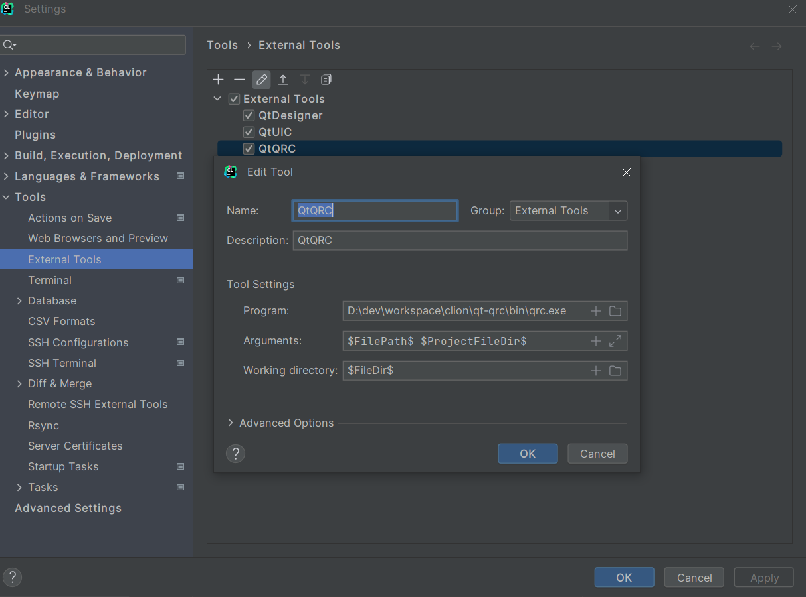
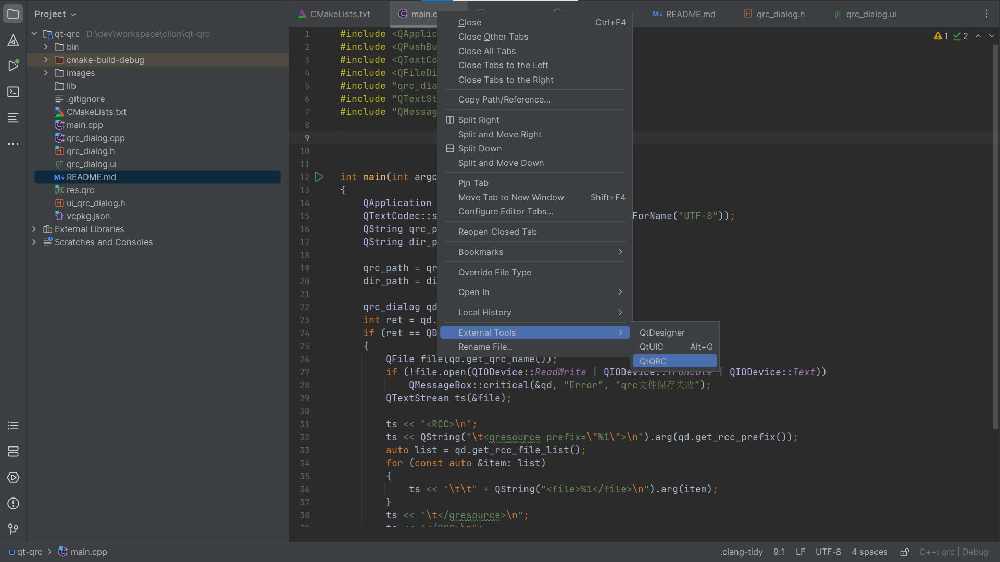
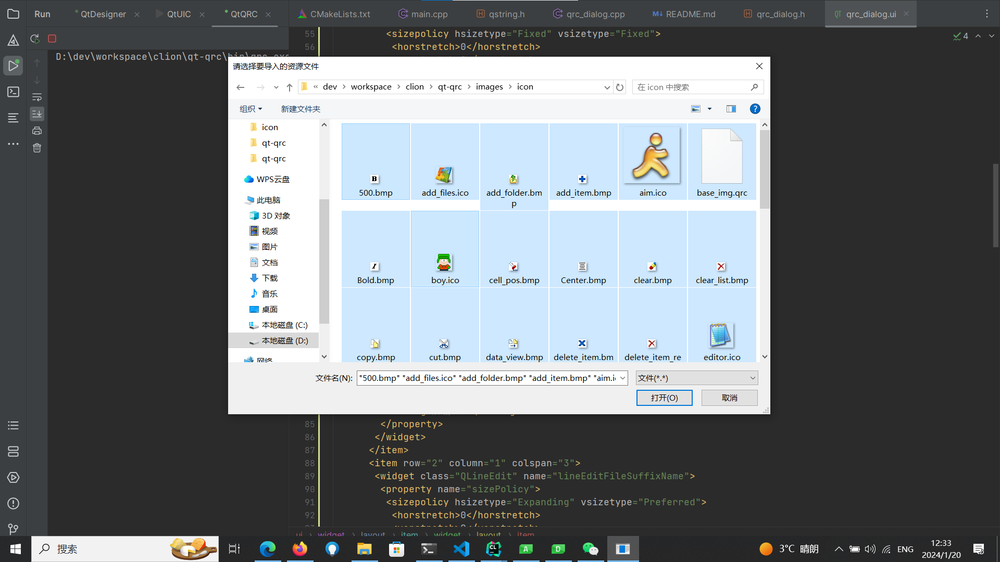
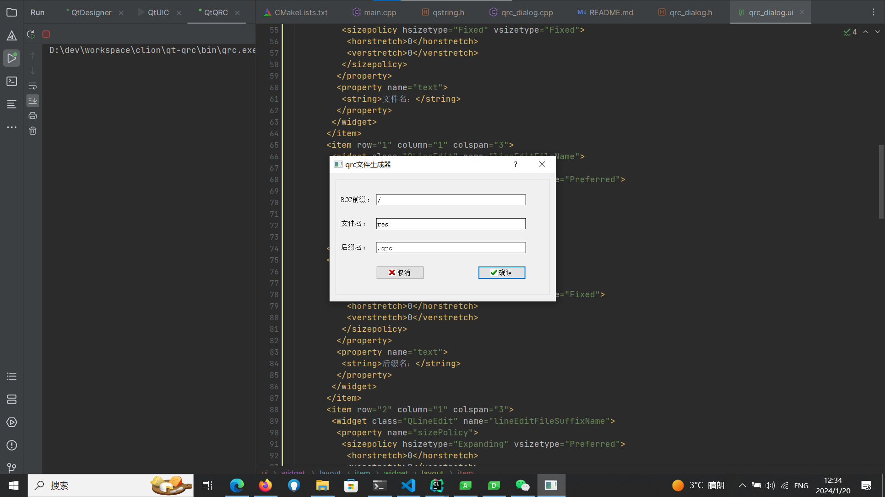

# Qt-QRC Creator工具
简介：一个基于Qt开发的小工具，适用与多个平台，Windows、Linux等。
解决的痛点是，使用CLion基于QT开发带有界面的程序时，
无法自动导入资源生成.qrc资源文件。使用本工具可以轻松导入资源文件，自动生成.qrc文件。

> - bin/qrc.exe可以直接使用，其他平台请自行编译。
> - 基于Qt Widgets实现文件对话框。
> - 实现一个简单qrc对话框。
> - 欢迎各位猿佬补充其他功能。
### 下面是使用方法，图例如下：

